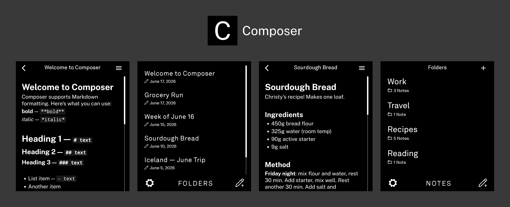

# Composer

A distraction-free Markdown notes tool for the Light Phone III.

Composer is a minimal writing tool for people who want to capture thoughts, ideas, and notes – using Markdown that renders as you type and makes syntax disappear. Built to feel like a natural extension of the Light Phone experience.

---

## Features

* WYSIWYG Markdown editing – formatting renders in real time as you type
* Copy note contents as either Markdown or plain text
* Organize notes into folders, with bulk move and reorder support
* Notes sorted by most recently edited, always at the top
* Rename notes independently from their body content
* Delete notes individually or in bulk

---

## Supported Markdown

* **Bold** — `**text**`
* *Italic* — `*text*`
* Headings — `# H1`, `## H2`, `### H3`
* Unordered lists — `- item`
* Ordered lists — `1. item`
* Inline code — `` `code` ``
* Blockquotes — `> text`

---

## Installing on Light Phone III

I highly recommend using Obtainium to ensure you receive future updates and new features automatically. Just add [the repo URL,](https://github.com/zacksimpson/composer-tool/) make sure you're able to install apps from unknown sources, and you're all set.

Alternatively, you can download the latest APK from the Releases tab.

---

## Building

This project uses [Expo](https://expo.dev) and [EAS Build](https://docs.expo.dev/build/introduction/).

### Prerequisites

* [Bun](https://bun.sh)
* [EAS CLI](https://docs.expo.dev/build/setup/)
* An Expo account

### Steps
* bun install
* eas login
* eas build --platform android --profile preview

EAS will build the APK in the cloud and provide a download link.

---

## Support

If any of my tools have been useful to you, I'd love to hear from you! Feel free to reach out [here](mailto:zacksimpson24@gmail.com). Another way to support is to [consider sponsoring](https://github.com/sponsors/zacksimpson). Either way, it means a lot!

---

## Credits

* [vandamd](https://github.com/vandamd) – [light-template](https://github.com/vandamd/light-template), the community Expo template this app is built on
* [iamkory](https://www.reddit.com/user/iamkory/) – [LighterOS Figma design toolkit](https://www.figma.com/design/1k2PkAjOSet8f9jjVdhM2L/LighterOS?node-id=65-2018&t=3Qd2sXdySZCzTVtK-1), excellent reference for recreating the LightOS aesthetic
* [Milkdown](https://milkdown.dev) – WYSIWYG Markdown editor powering the writing experience
* [The Light Phone](https://www.thelightphone.com) – for building a phone worth making apps for, and for the native Notes tool whose design language Composer is directly modeled after
